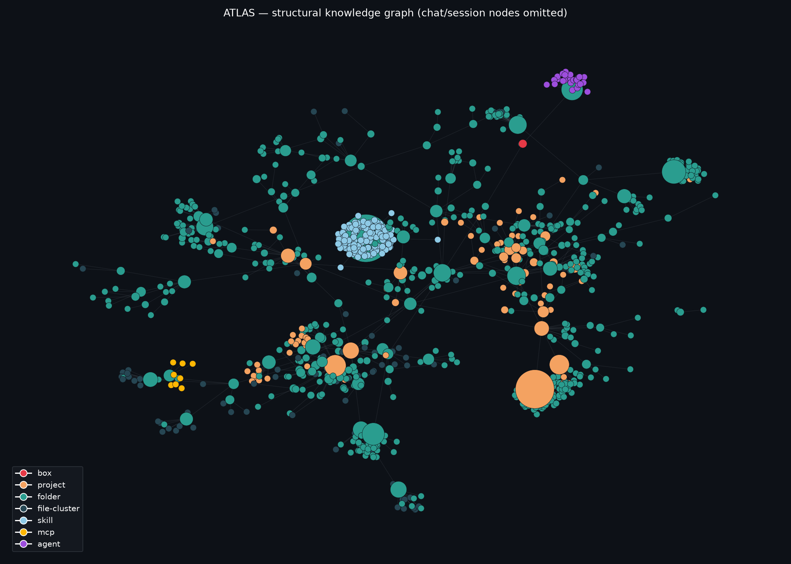

# ATLAS



A knowledge graph for my homelab. I got tired of agents re-reading the same folders every
session and burning tokens on it, so ATLAS walks the filesystem once, has a local model
(Ollama) write a one-line summary of each folder, and stores it all in SQLite. Any agent I
run queries the graph (`kg_search`, `kg_get`, `kg_neighbors`, `kg_tree`) instead of `ls` and
`cat`-ing through thousands of files. It's exposed as an MCP server so it works from
whatever agent I'm using that day, not locked to one tool.

Summaries are generated, not typed in by hand, the local model looks at a folder's
structure and writes the description itself. A structural fingerprint per folder means only
what's actually changed gets re-summarized on the next pass. I run this across three
machines, each builds its own graph locally, and `kg merge` folds one box's graph into a
central store so the fleet ends up queryable as one graph. It also indexes Claude Code
session transcripts and chat exports as nodes, so past work is searchable alongside the
filesystem, and it indexes installed skills/MCP servers/agents too, so a box's tooling is
part of the graph. The MCP server itself is stdlib only, no framework, about 200 lines of
stdio JSON-RPC 2.0 over SQLite.

## Layout

- `atlas/walker.py` — filesystem walker, adaptive depth, skips node_modules/.git/etc
- `atlas/fingerprint.py` — change detection
- `atlas/understanding.py` — Ollama summarization
- `atlas/store.py` — SQLite + FTS5 storage, WAL mode
- `atlas/link.py` — merging graphs across boxes
- `atlas/chats.py`, `atlas/claude_web.py`, `atlas/gpt.py` — indexing chat history
- `atlas/env.py` — indexing installed skills/MCP servers/agents
- `mcp_server.py` — the MCP server itself

## CLI

```
kg walk <root>                # walk a directory into the graph
kg index-chats                # index Claude Code session transcripts
kg index-claude-web <export>  # index a Claude.ai conversations.json export
kg index-gpt <archive>        # index a ChatGPT export
kg index-env                  # index installed skills/MCP servers/agents
kg merge <other-db>           # merge another box's graph into this one
kg search "<query>"           # full-text search over the graph
```

## Tests

```
pytest
```
